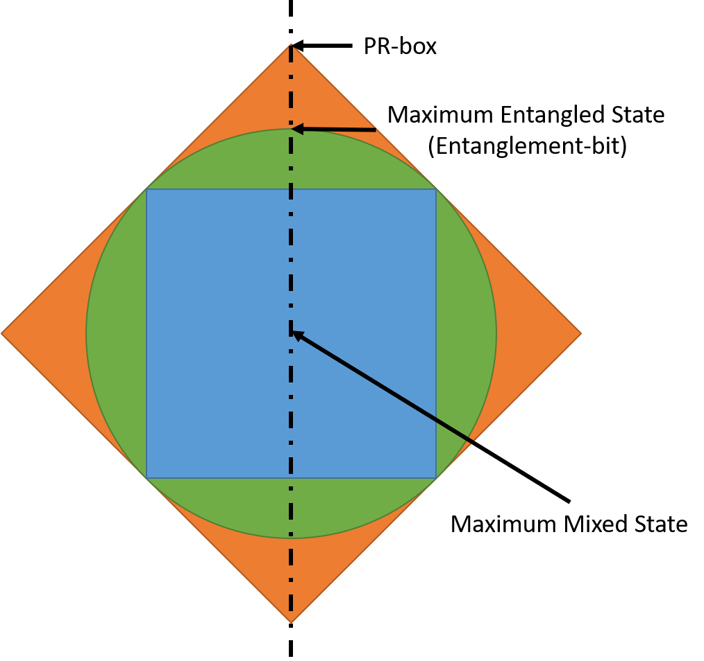

* content
{:toc}

在前一章[从贝尔不等式到量子纠缠 (I)]({{ 'quantum%20information%20theory/Bell_to_Entanglement_01/' | prepend: site.baseurl}})中, 我介绍了一下设备无关测量以及该语境下的(演化的)局域性模型,
也就是"无信号" (non-signaling), 以及由两种不同内积导出的模型: "量子" (quantum) 与
"局域/经典" (local/classical).

在前一章最后我提到了 $\text{local}\subsetneq\text{quantum}\subsetneq\text{non-signaling}$
的包含关系. 在讨论这个关系之前, 让我们先详细介绍一下设备无关测量, 并严格定义这三种模型的数学表达.

# 设备无关测量模型

正如上一章所说, 在设备无关测量中我们只讨论一切测量的性质, 而不关心某个具体测量设备的性质.
我们可以把实验设备抽象成一个盒子, 上面有很多个按钮以及很多个指示灯 (在信息学中我们经常用
flag 表示输出, 但是似乎这不符合中国人的直觉). 当我们按下一个按钮, 有且仅有一个灯会亮起.
至于哪一个灯会亮是一个概率事件. 按钮代表着我们可以选择的测量方式, 我们把测量集合叫做 $\Gamma$,
每一种测量用符号 $A\in\Gamma$ 表示. 指示灯代表着所有可能的结果, 我们用字母表 $X$ 编码所有的结果,
每一个结果分配一个字符 $a\in X$. 条件概率 $P(a\vert A)$ 唯一地定义了一个设备无关测量.
前段时间火热的量子密钥分发协议就是基于设备无关测量的, 它的安全性与具体的通信系统无关.

<!--  -->

当我们讨论局域性时, 我们需要的是两个类空测量事件, 也即是两个独立的测量事件, 分别用字母表
$\Gamma_A$ 与 $\Gamma_B$ 表示, 而它们的结果分别用字母表 $X$ 与 $Y$ 表示.
对于这样的二分问题, 我们讨论的是联合条件概率 $P(a,b\vert A,B)$. 这里 $a\in X$, $b\in Y$.

---

# 包含关系

## 无信号

最一般地, 如果两个事件是没有因果关系的 (因为类空), 则必然有

$$\sum_a P(a,b\vert A,B) = \sum_a P(a,b\vert A^\prime,B)$$

也即是 $P(b\vert A,B) = P(b\vert A^\prime, B)$, $\forall A,A^\prime\in \Gamma_A$,
或者说测量 B 的结果与测量 A 的选择无关. 如果存在两个类空事件违反了无信号模型,
那么狭义相对论就必然错了, 两个事件之间发生了因果关系. 目前人类并没有观察到这类现象.

## 量子

正如我之前反复提到的, 量子态由希尔伯特空间上的密度算子(迹为 $1$ 的半正定算子)
$\rho\in S(\mathcal{H})$ 所描述. 态可以有一个概率分布,即 $(\rho(\lambda),P(\lambda))$.

测量由半正定算子 $M=\{E_a\}$ 表示, 其中 $\sum_a E_a=\mathbb{I}$ , 而给定态 $\rho(\lambda)$,
测量结果为 $a$ 的概率为 $\tr[E_a\rho(\lambda)]$. 对于二分系统, 希尔伯特空间应该是一个张量积,
也即是空间由两组独立的自由度组成 $\mathcal{H}^A\otimes\mathcal{H}^B$.
测量分别作用在两个不同的子空间 $A_a\otimes\mathbb{I}_B$ 与 $\mathbb{I}_A\otimes B_b$ 上.

这个情况下 $P(a\vert A,\lambda)= \tr[A_a\otimes\mathbb{I}_B \rho(\lambda)],
P(b\vert B,\lambda)=\tr[\mathbb{I}_A\otimes B_b \rho(\lambda)]$

它们的联合概率由 $\tr[(A_a\otimes B_b)\rho_{(\lambda)}]$ 给出, 也就是说

$$P(a,b\vert A,B) = \sum_{\lambda}P(\lambda)\tr[A_a\otimes B_b\rho_{(\lambda)}]$$

我们可以看到

$$\sum_a P(a,b\vert A,B) =
\sum_\lambda P(\lambda)\tr\left[\sum_a A_a\otimes B_b \rho(\lambda)\right] =
\sum_\lambda P(\lambda)\tr\left[\mathbb{I}_A\otimes B_b \rho(\lambda)\right]$$

根据测量的定义, $\sum_a A_a = \mathbb{I}_A$ 对所有的测量都成立,
也就是说量子模型必然满足无信号理论:

> $\text{quantum}\subseteq\text{non-signalling}$

## 局域 (经典)

我们前面提到, 经典理论是实在的, 经典态由希尔伯特空间 $\mathcal{H}_A\otimes \mathcal{H}_B$
上的单位(实)向量 $\vec{v} \text{ or } \ket{v}$ 所表示, 它总是可以被写做
$\ket{v_A\otimes v_B}$. 根据类似于我们之前对量子模型讨论时的限制, 测量 $A$
与量子模型有着相同的形式. 这时

$$
\begin{aligned}
    P(a,b\vert A,B) &= 
    \sum_{\lambda}P(\lambda)\bra{v(\lambda)}A_a \otimes B_b\ket{v {(\lambda)}} \\
    &= \sum_{\lambda}P(\lambda)\bra{v_A(\lambda)} A_a\ket{v {(\lambda)}}
    \bra{v_A(\lambda)}B_b\ket{v {(\lambda)}} \\
    &= \sum_\lambda P(\lambda)P(a\vert A,\lambda)P(b\vert B, \lambda)
\end{aligned}
$$

对于量子模型, 当量子态为纯态的时候 $\rho = \outter{v}{v}$,
$\tr[A\rho] = \bra{v}A\ket{v}$, 量子态退化为经典态.

> $\text{local/classical}\subseteq \text{quantum}$

# 拓展的必要性

接下来我们要证明由经典理论拓展到量子理论的必要性, 也就是要证明这三个模型两两不等价.
这就工作就来自于著名的贝尔不等式. 当然, 我们现在通常讨论的是 Clauser, Horne,
Shimony, Holt 四人对贝尔不等式进行的推广, CHSH 不等式. 贝尔不等式可以作为 CHSH
不等式的一个特例, 有时我们也把 CHSH 不式就叫做贝尔不等式.

在这里, Alice 与 Bob 分别可以选择两种测量: $A, A^\prime, B, B^\prime$.
其中每一种测量都有两种结果, 我们在这些结果上定义一个随机变量 $a,b = \pm 1$.

定义 $E_{A,B}=\sum_{a,b=\pm 1}ab \ P(a,b\vert A,B)$,

$S = E_{AB} +E_{A^\prime B} +E_{A B^\prime} - E_{A^\prime B^\prime}$ 即为 CHSH 表达式.

## 对于经典模型

$$P(a,b\vert A,B)=\sum_\lambda P(\lambda)P(a\vert A,\lambda)P(b\vert B, \lambda)$$

$$E_{A,B}+E_{A,B^\prime} = \sum_{\lambda} P(\lambda)\sum_{a,b=\pm 1}ab\ P(a\vert A,\lambda)\left(P(b\vert B,\lambda)+P(b\vert B^\prime,\lambda)\right)$$

$$E_{A^\prime,B}-E_{A^\prime,B^\prime} = \sum_{\lambda}P(\lambda)\sum_{a,b=\pm 1} ab\ P(a\vert A^\prime,\lambda)\left(P(b\vert B,\lambda)-P(b\vert B^\prime,\lambda)\right)$$

先忽视 $\lambda$, 我们有

$$ \begin{aligned}
    & \sum_{a,b=\pm 1}ab\ P(a\vert A)\left(P(b\vert B)+P(b\vert B^\prime)\right) \\
    =& \sum_{a,b}ab \ P(a\vert A)P(b\vert B)+
        \sum_{a^\prime,b^\prime}ab\ P(a\vert A)P(b\vert B^\prime)
        +\left[\sum_{a,b}ab\ P(a\vert A)P(b\vert B)\right] \left[\sum_{a,b}ab\ P(a\vert A^\prime)P(b\vert B^\prime)\right]
        - \left[\sum_{a,b}ab\ P(a\vert A)P(b\vert B)\right] \left[\sum_{a,b}ab\ P(a\vert A^\prime)P(b\vert B^\prime)\right] \\
    =& \left[\sum_{a,b}ab \ P(a\vert A)P(b\vert B)\right]
        \left[1\pm \sum_{a,b}ab\ P(a\vert A)P(b\vert B^\prime)\right]
        + \left[\sum_{a,b}ab\ P(a\vert A)P(b\vert B^\prime)\right]
        \left[1\mp\sum_{a,b}ab\ P(a\vert A^\prime)P(b\vert B)\right]
\end{aligned}$$

它的绝对值 (三角不等式)
$$ \begin{aligned}
    &\abs{\left[\sum_{a,b}ab \ P(a\vert A)P(b\vert B)\right]
        \left[1\pm \sum_{a,b}ab\ P(a\vert A)P(b\vert B^\prime)\right]
        + \left[\sum_{a,b}ab\ P(a\vert A)P(b\vert B^\prime)\right]
        \left[1\mp\sum_{a,b}ab\ P(a\vert A^\prime)P(b\vert B)\right]} \\
    \leq& \abs{\left[\sum_{a,b}ab \ P(a\vert A)P(b\vert B)\right]
        \left[1\pm \sum_{a,b}ab\ P(a\vert A)P(b\vert B^\prime)\right]}
        + \abs{\left[\sum_{a,b}ab\ P(a\vert A)P(b\vert B^\prime)\right]
        \left[1\mp\sum_{a,b}ab\ P(a\vert A^\prime)P(b\vert B)\right]}
\end{aligned} $$

$ab$ 作为一个随机变量, 它的期望必然有 $\abs{\overline{ab}}\leq 1$, 所以上式

$$ \begin{aligned}
    \leq& \abs{1\pm \sum_{a,b}ab\ P(a\vert A)P(b\vert B^\prime)}
        + \abs{1\mp\sum_{a,b}ab\ P(a\vert A^\prime)P(b\vert B)} \\
    =& 1\pm \sum_{a,b}ab\ P(a\vert A)P(b\vert B^\prime)
        + 1\mp\sum_{a,b}ab\ P(a\vert A^\prime)P(b\vert B) \\
    =& 2\pm( \sum_{a,b}ab\ P(a\vert A)P(b\vert B^\prime)
        -\sum_{a,b}ab\ P(a\vert A^\prime)P(b\vert B)) \\
    =& 2\pm \sum_{a,b}ab\ P(a\vert A)(P(b\vert B^\prime) -P(b\vert B))
\end{aligned} $$

也就是说

$$ \begin{aligned}
    2\geq &
        \abs{\sum_{a,b=\pm 1}ab\ P(a\vert A)\left(P(b\vert B)+P(b\vert B^\prime)\right)}
        +\abs{\sum_{a,b=\pm 1}ab\ P(a\vert A^\prime)
            \left(P(b\vert B)-P(b\vert B^\prime)\right)} \\
    \geq& \abs{\sum_{a,b=\pm 1}ab\ P(a\vert A)\left(P(b\vert B)+P(b\vert B^\prime)\right)
    + \sum_{a,b=\pm 1}ab\ P(a\vert A^\prime)\left(P(b\vert B)-P(b\vert B^\prime)\right)}
\end{aligned} $$

由于对每一个 $\lambda$ 都成立, 且 $\sum_\lambda P(\lambda)=1$

$$\abs{S}\leq 2$$

由于所有的推导都来自于三角不等式, 这个界是紧的.

## 对于量子模型

密度矩阵满足

$$ \begin{aligned}
    P(a,b\vert A,B) =& \sum_{\lambda}P(\lambda)\tr[A_a\otimes B_b\rho{(\lambda)}] \\
    =& \sum_{\lambda}P(\lambda)
        \sum_k c_k \bra{v_k(\lambda)}A_a\otimes B_b\ket{v_k(\lambda)}
\end{aligned} $$

同样先不考虑 $\lambda$ 和 $c_k$.

$$ \begin{aligned}
    \sum_{a,b}ab\bar{v}A_a\otimes B_b \ket{v}
    =& \bra{v}\sum_{a,b}  aA_a \otimes b B_b\ket{v} \\
    =& \bra{v}(A_{+1}-A_{-1}) \otimes (B_{+1}-B_{-1})\ket{v}
\end{aligned} $$

定义 $\alpha=(A_{+1}-A_{-1})\otimes \mathbb{I}_B,
\beta = \mathbb{I}\_A\otimes (B\_{+1}-B_{-1})$, 则上式可以看作
$\ket{\alpha v}, \bra{\beta v}$ 的内积. (注意, 我们这里所有的算子都是厄米的)

对于每一个 $\lambda$ 和 $c_k$,

$$ \begin{aligned}
    \tilde S =&
    \braket{\alpha v}{\beta v}+\braket{\alpha^\prime v}{\beta v}
        +\braket{\alpha v}{\beta^\prime v}
        -\braket{\alpha^\prime v}{\beta^\prime v} \\
    =&\bra{\alpha v}(\ket{\beta v} +\ket{\beta^\prime v})
        +\bra{\alpha^\prime v}(\ket{\beta v}- \ket{\beta^\prime v})
\end{aligned} $$

当 $\ket{\alpha v}/ \!/ (\ket{\beta v}+\ket{\beta^\prime v})$ 时第一项达到最大(或最小).

以 $\alpha$ 为例, 考虑该向量的长度 $\sqrt{\braket{\alpha v}{\alpha v}}
= \sqrt{\langle \alpha^2 \rangle}$

注意 , 根据定义, $A_{+1}+A_{-1} = \mathbb{I}_A$, 且它们都是半正定算子.

我们可以把空间 $\mathcal{H}\_A$ 拆成3部分: $\Pi_+,\Pi_-,\Pi_\alpha$,
其中 $\Pi_+A_{-1}=0; \Pi_{-}A_{+1}=0$;

$\Pi_\alpha$ 为两个算子重叠的空间. $A_{+1} = \Pi_+ +M; A_- = \Pi_-+(\Pi_\alpha-M)$.

$$ \begin{aligned}
    \alpha^2 =&
        A_{+1}A_{+1} +A_{-1}A_{-1} -A_{-1}A_{+1} -A_{+1}A_{-1} \\
    =& \Pi_++M^2+\Pi_-+(\Pi_\alpha-M)^2 -2M+2M^2 \\
    =& \Pi_++\Pi_-+\Pi_\alpha -4 M-4M^2=(\mathbb{I}_A - 2M)^2
\end{aligned} $$

对于半正定算子

$$ \begin{aligned}
    &0\leq A_{-1}\leq\mathbb{I}_A \\
    \Rightarrow & -\Pi_+ \leq M\leq \Pi_- + \Pi_\alpha\leq\mathbb{I}_A
\end{aligned} $$

由于 $\Pi_+ M=0, M\geq 0$

$$-\mathbb{I}_A \leq \mathbb{I}_A -2 M\leq \mathbb{I}_A$$

$$0\leq(\mathbb{I}_A-2M)^2\leq \mathbb{I}_A$$

$\langle\alpha^2\rangle\leq 1$, 当 $M=0$, 也就是投影测量时, 对所有 $\ket{v}$ 都取到最大值 $1$.

这个结论对所有 $\alpha,\beta$ 都成立.

所以

$$ \abs{\tilde S} \leq \norm{\ket{\beta v} + \ket{\beta^\prime v}}
    +\norm{\ket{\beta v}- \ket{\beta^\prime v}} \leq 2\sqrt{2}$$

这些结果的凸组合

$$\abs{S} \leq 2\sqrt{2}$$

## 对无信号模型

Popescu-Rohrlich box 可以达到 $4$

$$\abs{S} \leq 4$$

# 总结

* 对于局域理论 $\abs{S} \leq 2$
* 对于量子理论 $\abs{S} \leq 2\sqrt 2$
* 对于无信号理论 $\abs{S} \leq 4$

我们可以画出相关几何

<!--  -->

关于这个图, 有几点要注意

1. 我们这里的论证是单向的: 如果一个理论描述的所有态都落在蓝色正方形内,
    不代表它一定是局域理论; 但是如果它描述的态在蓝色正方形外, 它一定不是局域理论.
2. 这个几何仅代表 CHSH 不等式, 这个形状不代表所有的非局域关系.
    我们换一个不等式就可能得到完全不同的几何.
3. 这些不等式是数学上的严格要求, 就算只违背 CHSH 不等式万分之一也是违背,
    事件相关度只要大于 $2$, 就算是 $2+10^{-100}$ 也一定是非经典/局域关系.

我们的设备无关模型表明了"扩充经典理论是否有必要"这件事是可证明的.
近些年不断在重复的贝尔实验就是在寻找我们的世界处于这个几何的什么位置.
我们所有的实验结果都表明, 存在蓝色正方形以外的系统, 但是所有结果都在绿色圆形之内.
也就是说, 我们目前的量子理论是充分的. 某种程度上来说它也是必要的,
至少经典理论是远远不够的.

但是量子理论的存在引出了一个非常诡异的问题: 我们的世界可以是纠缠的! 但是注意,
纠缠与非局域并不是等价的. 对于纯态而言, 纠缠就是非局域; 但是对于混态而言,
有些纠缠态是局域的(即不违背 CHSH 不等式). 长程纠缠是现代物理很多前沿问题的核心,
纠缠可以带来很多从直觉上来说很神奇的现象. 接下来, 我准备介绍一下什么是纠缠.